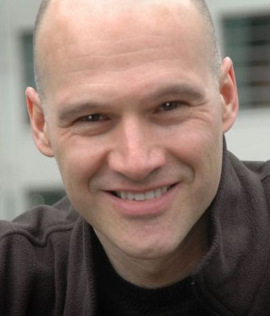

Resumé

-   [Home](../index.html "...sweet home")
-   [Research](../research/research.html "Research")
-   [Teaching](../teaching/5mb20/index.html "Teaching")
-   [Resumé](# "Resume")

#### Bert de Vries, Ph.D.

\
 [GN ReSound A.S.](http://www.gnresound-group.com/)\
 Het Eeuwsel 6\
 5612 AS Eindhoven, the Netherlands\
 tel. +31-40-2478328\
 e-mail:
[bdevries@remove-this.gnresound.com](javascript:linkTo_UnCryptMailto('nbjmup;c/efwsjftAuvf/om');)
\
 \
 Download [resumé in PDF format](CV-Bert-de-Vries.pdf)

-   [Interests](#principalInterests)
-   [Academic](#academicBackground)
-   [Employment](#employmentHistory)
-   [Achievements](#specialAchievements)
-   [University](#university)
-   [Publications](#publications)

\

Principal Interests
===================

Signal processing, medical engineering, machine learning, statistics,
research management, technical writing; applications to medical devices,
clinical trial design/analysis, hearing rehabilitation, multimedia
processing, digital communications and neural engineering.

Academic Background
===================

**12/91, Ph.D. Electrical Engineering, [University of
Florida](http://www.ufl.edu/)**, Gainesville, FL\
 Ph.D. research in signal processing under direction of Professor [Jose
C. Principe](http://www.cnel.ufl.edu/principe/principe.html).
Dissertation title: *[Temporal processing with neural networks-the
development of the gamma
model](http://www.uflib.ufl.edu/ufdc/?g=all&b=UF00082173)*.

**12/86, M.E. Electrical Engineering (equiv.), [Technical University
Eindhoven](http://www.tue.nl/en_index.html)**, Eindhoven, the
Netherlands\
 Focus areas: medical (thesis: intelligent alarms during anaesthesia)
and digital communications engineering.

Employment History
==================

**'12 - pres., Professor, [Technical University
Eindhoven](http://www.tue.nl/en_index.html)**, Signal Processing Systems
Group, EE dept., Eindhoven, the Netherlands.\

-   1 day/week appointment; Previous engagement: Research Fellow
    ('04-'11)
-   Research on **Personalization of Medical Signal Processing Systems**
-   Teach graduate class on [Adaptive Information
    Processing](../teaching/5mb20/index.html).

**'99-pres., Principal Scientist, [GN ReSound
A/S](http://www.gnresound.com/) (Philips Hearing Technologies** until
2001), Eindhoven, the Netherlands. \

-   Other engagements include: DSP Functional Leader ('11-pres.), Head
    DSP Research ('08-'11), Manager External Research ('01-'08),
    Technology Leader ('99-'01, Philips)
-   Research PI on low-power signal processing technology for the next
    generation of digital hearing aids.
-   Leadership/management tasks include(d) all aspects of team and
    project management (teams of about 10 engineers); (responsible for)
    the corporate DSP research track, including the roadmap, budget and
    management; initiating and managing key studies at academic
    institutions and contract research organizations.

**'93-'99, Member Technical Staff, [Sarnoff
Corporation](http://www.sarnoff.com/)**, Princeton, NJ.\

-   Research in advanced signal processing algorithms, initiating new
    technical and commercial thrusts, technical proposal writing and
    project management.
-   Principal investigator of funded projects on keyword spotting,
    digital hearing aids signal processing, speech enhancement and
    noise-robust speech recognition (co-PI).
-   Co-initiated and developed signal processing in financial markets
    program at Sarnoff.
-   Member medical image processing research team. Funded projects
    include blind signal processing for breast mammography and
    perceptually optimized image coding.

**'92-'93, Postdoctoral Fellow, [David Sarnoff Research
Center](http://www.sarnoff.com/)**, Princeton, NJ\

-   Developed neural network based speech recognition method (50% error
    reduction relative to competing methods).

**'87-'91, Research/Teaching Assistant, [University of
Florida](http://www.ufl.edu/)**, Gainesville, FL\

-   Taught and assisted in graduate classes in digital signal
    processing, control theory and computer architecture. Developed and
    patented gamma neural network for Ph.D. research.

Special Achievements
====================

#### Awards

-   Return-on-Performance Award, for technical work on Speech
    Enhancement technology, Sarnoff Corporation, 1998
-   Achievement Award, for ''Leadership and technical contributions in
    the area of adaptive speech enhancement'', Sarnoff Corporation, 1997
-   David Sarnoff Event Focus Award for ''Winning Sarnoff's First
    Commercial Contract for Speech Processing'', David Sarnoff Research
    Center, 1996.
-   Presidential Recognition Award, University of Florida, 1988.
-   δ-Butterweck Award (awards top GPA), Technical University Eindhoven,
    1984.

#### Invited Lectures (selection)

-   Clinical Physicist Post-graduate school, (''The Future of Hearing
    Aids''), Amersfoort January 2013
-   Delft Univ. of Technology, (''Machine Learning for Hearing Aids
    Technology''), Delft, March 2012
-   International Forum for Hearing Instrument Developers, (''Bayesian
    Machine Learning for Hearing Aid Design, Fitting and
    Personalization''), Oldenburg (Germany), June 2011
-   University of Florida, (''Machine Learning Trends in the Hearing
    Aids Industry''), Gainesville, FL, April 2010
-   SIKS Research School, (''Gaussian mixture models and the EM
    Algorithm''), Vught, Dec 2008
-   GN Nordic Audiology College, (''Learning technology in hearing
    aids''), Oslo, Norway, Sep 29, 2006
-   University of Nijmegen, (''Machine learning for hearing aids''),
    Nijmegen, Netherlands, June 3rd, 2004
-   University of Florida, (''DSP for modern industrial hearing aids''),
    Gainesville, FL, January 2004
-   International Forum for Hearing Aid Developers (''Warped-frequency
    filterbanks''), Oldenburg, Germany, July 2003
-   Keynote address (''An industrial perspective on intelligent hearing
    aids'') at 2nd McMaster-Gennum Workshop on Intelligent Hearing
    Instruments, Niagara-on-the-Lake, ON, Sep 2001
-   NIDCA/NASA/VA Hearing Aids Improvement Conference, May 1997
-   Lucent Technologies, Bell Laboratories, November 1996
-   AT&T Research, July 1996
-   NSA (U.S. Government), June 1993
-   Neural Network Workshop, Rutgers University, October 1992
-   David Sarnoff Research Center, October 1991

#### Professional Activities (selection)

-   Associate Editor for [IEEE Transactions on Neural Systems and
    Rehabilitation Engineering](http://tnsre.bme.columbia.edu), 2012 -
    present
-   Invited jury member for Open Technology Program (OTP) research
    proposals to Dutch Technology Foundation STW, Dec. 2010
-   Invited DSP expert on IWT (Flemish Institute for Science and
    Technology) panel to evaluate candidate PhD proposals, Brussels,
    Nov. 2005 and May 2006
-   Organizer/chair special session on 'DSP for Intelligent Hearing
    Aids', ICASSP 2002, Orlando, FL, May 2002.
-   Publicity chair, Neural Networks for Signal Processing Workshop,
    Amelia island, Florida, 1997 and Cambridge, UK, 1998.
-   Session chair Non-linear Systems Identification, ICASSP96, Atlanta,
    GA, May 1996, and IEEE NNSP-98 Workshop, Cambridge, UK, September
    1998
-   (Elected) member of ''IEEE Technical Committee on Neural Networks
    for Signal Processing Society'', 1995-1998.
-   Invited researcher in USA government sponsored Robust Speech
    Processing Workshop, July-August 1993.
-   Member of various professional societies (e.g., IEEE, INNS)

#### Refereed Publications

IEEE Transactions on Signal Processing, IEEE Transactions on Neural
Networks, NeuroComputing Journal, Neural Networks Journal, EURASIP
Journal of Applied Signal Processing, Advances in Neural Information
Processing Systems (NIPS) Conferences, ICASSP Conferences and others.

Activities at Technical University Eindhoven
============================================

#### Teaching

-   [Adaptive Information Processing](../teaching/5mb20/index.html).
    Together with [Tjalling
    Tjalkens](http://www.sps.ele.tue.nl/members/T.J.Tjalkens/), since
    spring 2005 I teach a core graduate class on the fundamentals of
    machine learning.
-   [Machine Learning](../teaching/mlrc04/home.html). I organized a
    machine learning reading club for GN ReSound staff and TU/e graduate
    students. Fall 2004.

#### Research

My current research focuses on applications of Bayesian machine learning
to personalization of hearing aid algorithms. In July 2006, together
with [Tom Heskes](http://www.cs.ru.nl/staff/Tom.Heskes) and [Wouter
Dreschler](http://www.ac-amc.nl/medewerkers/dreschler.html), we received
a 650K € grant from [STW](www.stw.nl) to pursue further research on
*Personalization of Hearing Aids through Bayesian Preference
Elicitation*.

#### Recent Student Supervision

-   Maarten Thomassen, M.Sc. practical training project, *Spectral Audio
    Monitoring*, July 2012
-   Joris Kraak, M.Sc.-thesis, *Computer-Aided Algorithm Design for
    Audio Processing*, April 2012
-   Joris Kraak, M.Sc. practical training project, *Optimization of a
    Spectral Noise Tracking Algorithm*, Dec. 2010
-   Jianfeng Li, M.Sc.-thesis, *Acoustic scene-adaptive speech
    enhancement*, Aug. 2010
-   Jianfeng Li, M.Sc.-project, *Spatial defect clustering on
    semiconductor wafers using image processing techniques*, Aug. 2009
-   Xueru Zhang, P.D.Eng.-thesis: *Bayesian periodogram smoothing for
    speech enhancement*, Sep. 2008
-   Rene Besseling, M.Sc. project: *Gaussian processes in Bekesy
    audiometry*, June 2008
-   Serkan Ozer, M.Sc.-thesis: *Bayesian linear regression for
    user-adaptive hearing aids*, Aug. 2007
-   Anton Vakrushev, P.D.Eng.-thesis: *Interactive machine learning for
    Personalization of hearing aid algorithms*, Sep. 2006.
-   Ronnie van Loon, M.Sc.-thesis: *a Probabilistic Approach to Sound
    Classification*, June 2007.
-   Jorik Caljouw, M.Sc. practical training on *PDA-based Interfacing to
    a real-time audio platform*, Dec. 2005.
-   Paul Aelen, M.Sc. project, [Determination of the Intra Uterine
    Pressure with electrodes on the
    abdomen](../papers/AelenP05-Determination-of-the-Intra-Uterine-Pressure.pdf),
    Dec. 2005.
-   Job Geurts, M.Sc. practical training on *[A PC-based real-time
    simulation platform for evaluating hearing aid
    algorithms](../papers/GeurtsJ05-A-PC-based-real-time-simulation-platform.pdf)*,
    Jun. 2005.

#### Care and Cure theme

I actively participated in the development of the Care and Cure theme
roadmap for the EE department, 2008.

Personal
========

Born on June 28th 1962. Dutch citizen. Leisure interests: sports, travel
and reading.

references
==========

[Dr. Jose C. Principe](http://www.cnel.ufl.edu/principe/principe.html),
Distinguished Professor of Electrical Engineering, (Ph.D. supervisor).\
 University of Florida, Gainesville, FL\

Other references on request.

Publications
============

#### Impact Factor

10 journal articles, 13 patents, 50 conference contributions with
citation numbers (high to low)
146,108,69,33,33,31,30,29,21,16,14,12,11,11,10,7,7, ... Hirsch- index =
12, Google Scholar, Feb-2011.

(\>60 unpublished technical reports (company confidential))

#### Journal Articles and Book Chapters

Rik Vullings et al., An Adaptive Kalman Filter for ECG Signal
Enhancement, *IEEE Transactions on Biomedical Engineering*, vol.58,
no.4, April 2011

Alexander Ypma et al., [On-line Personalization of Hearing
Instruments](http://www.hindawi.com/GetArticle.aspx?doi=10.1155/2008/183456),*EURASIP
Journal on Audio, Speech and Music Processing*, September 2008.

Tjeerd Dijkstra et al., The Learning Hearing Aid: Common-Sense Reasoning
in Hearing Aid Circuits, *The Hearing Review*, issue October 2007.

David Zhao et al., On-line Noise Estimation Using Stochastic-Gain HMM
for Speech Enhancement, *IEEE Transactions on Audio, Speech and Language
Processing*, vol.16, no.4, May 2008.

Jose Principe et al., Locally Recurrent Networks: The Gamma Operator,
Properties and Extensions, invited book chapter in *Neural Networks and
Pattern Recognition*, Omidvar and Dayhoff (eds.), Academic Press, 1997.

Bert de Vries, Short term memory structures for dynamic neural networks,
book chapter in: *Artificial Neural Networks for Speech and Vision*,
Richard Mammone (ed.), Chapman & Hall Ltd., 1994.

Bert de Vries and Jose Principe, [The gamma model-A new neural network
for temporal processing](../papers/nn92.pdf), *Neural Networks* vol.
5(4), pp. 565-576, 1992.

Jose Principe and Bert de Vries, [The gamma filter-A new class of
adaptive IIR filters with restricted
feedback](../papers/ieeetrsp92.pdf), *IEEE transactions on signal
processing* vol. 41(2), pp. 649-656, 1992.

Bert de Vries, [Temporal processing with neural networks-the development
of the Gamma model](http://ufdc.ufl.edu/UF00082173/00001), *Ph.D.
dissertation*, University of Florida, 1991.

Joachim Gravenstein et al., Sampling intervals for clinical monitoring
of variables during anesthesia, *Journal of clinical monitoring* vol
5(1), 1989.

Jan J. van der Aa, Bert de Vries and Joachim Gravenstein, Toward more
sophisticated monitoring alarms, *Journal of clinical monitoring* 4 (2),
1986.

#### Patents

Bert de Vries et al., Efficient evaluation of hearing ability, submitted
by GNR Ref.: P1669 EP, Albihns Ref.: P13304 US / P13303, April 2009

Alexander Ypma et al., Asymmetric synchronization of hearing aid
algorithms, submitted by GN ReSound, patent no. 09174982.0-2225, filed
4-Nov-2009.

Alexander Ypma et al., Learning control of hearing aid parameter
settings, submitted by GN ReSound, filed 16-Mar-2007.

Bert de Vries and Alexander Ypma, Optimization of Hearing Aid
Parameters, filed by GN ReSound, patent no. 06791465.5-1224, 10/13/06.

David Zhao, Bastiaan Kleijn, Alexander Ypma and Bert de Vries, Method
and Apparatus for Improved Estimation of Non-stationary Noise for Speech
Enhancement, filed by GN ReSound, patent no. 06119399.1-224, 08/23/06.

Bert de Vries and Rob de Vries, Fitting methodology and hearing
prosthesis based on signal-to-noise ratio loss data, USA patent
registered for GN ReSound, no. 20040047474, 03/11/2004.

L. Parra and B. de Vries, Method and apparatus for adaptive speech
detection by applying a probabilistic description to the classification
and tracking of signal components, patent registered for Sarnoff
Corporation, LG Electronics, Inc., no. 6691087, 10-Feb. 2004.

Bert de Vries, Noise Spectrum Tracking for Speech Enhancement, patent
registered for Sarnoff Corporation, no. US6289309, 9/11/01.

J. Lubin et al., Method and apparatus for training a neural network to
learn and use fidelity metric as a control mechanism , patent registered
for Sarnoff Corporation, no. US6075884, 6/13/2000.

Bert de Vries, Method and apparatus for filtering signals using a gamma
delay line based estimation of power spectrum, patent registered for
Sarnoff Corporation, no. US6073152, 6/6/2000.

J. Lubin, M. Brill, B. de Vries, O. Finard, Method and apparatus for
assessing the visibility of differences between two image sequences,
patent registered for Sarnoff Corporation, no. US5974159, 10/26/1999.

Bert de Vries, Method and system for training a neural network with
adaptive weight updating and adaptive pruning in principal components
space, patent registered for David Sarnoff Research Center, no.
5,812,992, 9/22/98.

Bert de Vries and Jose Principe, An adaptive filter based on a recursive
delay line, patent registered for University of Florida, no. 5,301,135,
April 1994.

#### Conferences and Workshops

Ungureanu C. et al., A Bayesian Network for Detection of Seizures, *1st
Jan Beneken Conference on Modeling and Simulation of Human Physiology*,
Eindhoven, Netherlands, 2013

Petkov P. et al., Discrete Choice Models for Non-Intrusive Quality
Assessment, *Interspeech 2011*, Florence, Italy, 2011

Rob de Vries et al., A software suite for automatic beamforming
calibration, *Int'l Hearing Aid Research Conference*, Lake Tahoe, CA,
August 2010

S.I. Mossavat et al., A Bayesian hierarchical mixture of experts
approach to estimate speech quality, *QoMEX 2010*, Trondheim, Norway,
June 2010

Jos Leenen and Bert de Vries, Current DSP and Machine Learning Trends in
the Hearing Aids Industry, *IEEE Benelux Signal Processing Symposium:
Signal Processing for Digital Hearing Aids*, Delft, NL, April 2010

Xueru Zhang et al., Bayesian periodogram smoothing for speech
enhancement, *European Symposium on Artificial Neural Networks
(ESANN-09)*, Bruges, April 2009

Adriana Birlutiu et al., Towards hearing aid personalization: preference
elicitation from audiological data, *Scientific ICT-Research Event
Netherlands (SIREN)*, Amsterdam, Sep. 2008

Tjeerd Dijkstra et al., HearClip: an Application of Bayesian Machine
Learning to Personalization of Hearing Aids, Presentation at *Dutch
Society for Audiology Meeting*, Sep. 2008

Bert de Vries, Fast Model-Based Fitting through Active Data Selection,
*Int'l Hearing Aid Research Conference*, Lake Tahoe, CA, August 2008

Rolph Houben et al., Construction of a virtual subject response database
to reduce subject testing, *Int'l Hearing Aid Research Conference*, Lake
Tahoe, CA, August 2008

Bert de Vries et al., The Complexity of Hearing Aid Fitting, presented
at *International Symposium on Auditory and Audiological Research*,
Helsingor, Denmark, August 2007

Jos Leenen et al., Learning Volume Control for Hearing Aids, presented
at *International Symposium on Auditory and Audiological Research*,
Helsingor, Denmark, August 2007

Alexander Ypma et al., Bayesian Feature Selection for Hearing Aid
Personalization, *MLSP-07*, Thessaloniki, Greece, 2007

Adriana Birlutiu et al., Personalization of Hearing Aids through
Bayesian Preference Elicitation, *NIPS workshop on User Adaptive
Systems*, Whistler, BC, Canada, December 2006

Bert de Vries et al., Bayesian Machine Learning for Personalization of
Hearing Aid Algorithms, *Int'l Hearing Aid Research Conference*, Lake
Tahoe, CA, August 2006

Alexander Ypma, Bert de Vries and Job Geurts, [Robust Volume Control
Personalization from On-line Preference
Feedback](../papers/YpmaA06-Robust-Volume-Control-Personalization.pdf),
*IEEE Int. Workshop on Machine Learning for Signal Processing*,
Maynooth, Ireland, 2006

Bert de Vries, Tom M. Heskes and Tjeerd M. H. Dijkstra, [Bayesian
Incremental Utility Elicitation with Application to Hearing Aids
Personalization](../papers/060602-Valencia-Personalization-poster.pdf),
*Valencia/ISBA 8th World Meeting on Bayesian Statistics*, Benidorm,
Spain, June 2006

Tjeerd M. H. Dijkstra et al., [A Bayesian decision-theoretic framework
for
psychophysics](../papers/DijkstraT06-Bayesian-decision-theoretic-framework-for-psychophysics.pdf),
*Valencia/ISBA 8th World Meeting on Bayesian Statistics*, Benidorm,
Spain, June 2006

Alexander Ypma, Bert de Vries and Job Geurts, A learning volume control
that is robust to user inconsistency, *The second annual IEEE
BENELUX/DSP Valley Signal Processing Symposium*, Antwerp, March 2006

Paul Aelen et al., Electrohysterographic Estimation of the Intra-Uterine
Pressure, *The second annual IEEE BENELUX/DSP Valley Signal Processing
Symposium*, Antwerp, March 2006

Tom Heskes and Bert de Vries, [Incremental Utility Elicitation for
Adaptive
Personalization](../papers/Heskes-deVries-05-Incremental-Utility-Elicitation-for-Adaptive-Personalization.pdf),
*Belgian-Dutch Conference on Artificial Intelligence (BNAIC)*, Brussels,
October 2005

Bert de Vries and Rob de Vries, An Integrated Approach to Hearing Aid
Algorithm Design, *Int'l Hearing Aid Research Conference*, Lake Tahoe,
CA, August 2004

Harald Pobloth et al., Speech Coding for Wireless Communication in the
Hearing Aid Environment, *Int'l Hearing Aid Research Conference*, Lake
Tahoe, CA, August 2004

Bert de Vries and Rob de Vries, An Integrated Approach to Hearing Aid
Algorithm Design for Enhancement of Audibility, Intelligibility and
Comfort, *IEEE Benelux Signal Processing Symposium*, Hilvarenbeek,
Netherlands, April 2004

Rob de Vries and Bert de Vries, [Toward SNR-Loss Restoration in Digital
Hearing Aids](../papers/icassp02.pdf), *ICASSP 2002*, Orlando, FL, May
2002

Bert de Vries, Jos Leenen, A Low Power Digital AGC Circuit for Dynamic
Range Control of an A/D Converter, *International Hearing Aid Research
(IHCON) Conference 2000*, Lake Tahoe (CA), August 2000

Lucas Parra, Clay Spence and Bert de Vries, Convolutive Blind Source
Separation based on Multiple Decorrelation, *IEEE workshop on Neural
Networks for Signal Processing VIII*, pp.23-32, Cambridge, UK, 1998

Bert de Vries, Blind Signal Processing for Hearing Aids, *NIH Hearing
Aids Improvement Conference, Bethesda*, MA, May 1997

Bert de Vries, Adaptive Gamma Filters for Miniature Hearing Aids, *NIH
Hearing Aids Improvement Conference*, Bethesda, MA, May 1997

Bert de Vries, [Adaptive rank filtering based on error
minimization](../papers/icassp97.pdf), *ICASSP-97*, Munich, April 1997

Lucas Parra, Clay Spence, Bert De Vries, [Convolutive Source Separation
and Signal Modeling with Maximum
Likelihood](http://humanism.org/%7Elucas/publish/isis97.pdf),
*International Symposium on Inteligent Systems* (ISIS'97), 1997, Regio
Calabria, Italy

Q. Lin et al., [Robust distant-talking speech
recognition](../papers/icassp96.pdf), *ICASSP-96*, Atlanta,GA, May 1996

Bert de Vries et al., [Neural network speech enhancement for noise
robust speech recognition](../papers/iwannt95.pdf), *International
Workshop on Applications of Neural Networks to Telecommunications*,
Sweden, May 1995

Lin et al., Experiments on distant-talking speech recognition, *ARPA
Workshop on Spoken Language Technology*, Austin, TX, January 1995.

Qiguang Lin et al., System of microphone arrays and neural networks for
robust speech recognition in multimedia environments, Proceedings
*International Conference on Spoken Language Processing*, Yokohama,
Japan, September 1994.

Bert de Vries, Gradient-based adaptation of network structure,
*International Conference on Artificial Neural Networks 94*, Sorrento,
Italy, May 94.

Che et al., Microphone Arrays and Neural Networks for Robust Speech
Recognition, *ARPA Workshop on Human Language Technology*, Princeton,
NJ, March 1994.

Bert de Vries et al., An application of Gamma delay lines to "BDG"
phoneme classification, *Government Microcircuit Applications Conference
proceedings*, New Orleans, LA, November 1993.

Bert de Vries, Time-varying neural networks for large tasks,
*International Conference on Artificial Neural Networks proceedings*,
Amsterdam, the Netherlands, September 13-16, 1993.

J.C. Principe et al., Backpropagation through time with fixed memory
size requirements, *Proceedings of Workshop on Neural Networks for
Signal Processing*, Linthicum Heights, MD, USA, Sep. 1993.

Bert de Vries et al.,Learning with target trajectory constraints for
sequence classification tasks, *ICASSP-93*, Minneapolis, MN, April 1993.

Jyh-Ming Kuo, Jose Principe and Bert de Vries, Noise reduction using the
focused gamma network, *Advances in Neural Information Processing
Systems*, vol. 5, 1993.

Bert de Vries et al., [Short Term Memory Structures for Dynamic Neural
Networks](../papers/asilomar92.pdf), *Asilomar-92* Conference
proceedings, Pacific Grove, CA, 1992.

T. Oliveira a Silva et al., Generalized feedforward filters with complex
poles, *Proceedings of the 1992 IEEE workshop on Neural Networks for
Signal Processing*, Copenhagen, Denmark, 1992.

Jyh-Ming Kuo, Jose Principe and Bert de Vries, Prediction of chaotic
time series using recurrent networks, *Proc. of the 1992 IEEE workshop
on Neural Networks for Signal Processing*, 1992.

Jose Principe, Bert de Vries and Pedro G. de Oliveira, Generalized
feedforward structures: a new class of adaptive filters, *ICASSP-92*,
San Francisco, vol. IV, pp. 245-248, 1992.

T. Oliveira e Silva, P. Guedes de Oliveira, J. C. Prmncipe and B. de
Vries, A Complex Pole Extension to the Gamma Filter, *The INESC Journal
of Research & Development*, vol. 3, no. 1, pp. 35-41, Jan./Jun. 1992.

Bert de Vries et al., [Adaline with adaptive recursive
memory](../papers/nnsp91.pdf), *Proceedings IEEE workshop on signal
processing*, Princeton, NJ, 1991.

Bert de Vries et al., Modeling applications with the focused gamma net,
*NIPS-4 proceedings*, Denver, CO, 1992.

Bert de Vries et al., Some practical issues concerning the gamma neural
net, *Proceedings IJCNN-91*, Seattle, WA, 1991.

Bert de Vries and Jose Principe, [A theory for neural nets with time
delays](../papers/nips3.pdf), *NIPS-3 Proceedings*, Denver, 1991.

Bert de Vries et al., Neural net models for temporal processing,
*Proceedings nineth southern biom. eng. conference*, Miami, FL, 1991.

Bert de Vries et al., A new neural net model for temporal processing,
*12th ann. int. conf. IEEE on the eng. in medicine and biology society*,
Philadelphia, PA, 1990.

Bert de Vries et al., Artificial neural networks as a computational
paradigm for detection of anaesthetic complications, *Computers in
Anesthesia 10*, New Orleans, LA, 1989.

Bert de Vries et al., Distribution of anesthesia related occurrences
during surgical operations, *Anesthesiology review* 14 (6), 1987.
